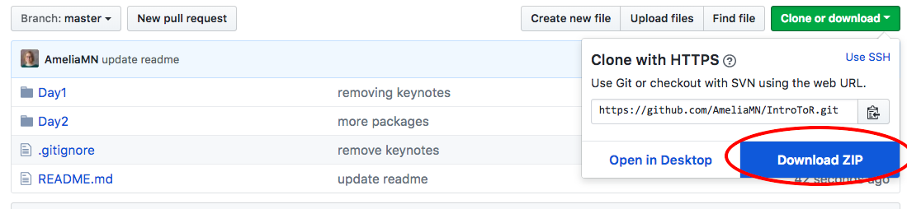

# basic-R-tutorial

This is a repo with materials for an informal tutorial about R and RStudio that I am giving at EPA on April 4, April 18, and May 2.

To download the materials, click on "Clone or download" and select "Download ZIP"

## About the Materials

What is here is quickly assembled. I am heavily borrowing from course materials by Amelia McNamara for a 2-day course that she gave at rstudio::conf 2018. Her repo is here: [https://github.com/AmeliaMN/IntroToR] 
I am also using material from "R for Data Science" as a guide.

First session:
 * Get familiar with the RStudio environment  
 * How to run scripts, install packages, and find documentation  
 * Read in and play around with an example dataset  

Second session:
 * Review/questions on RStudio, installing/loading packages, etc?
 * Joining two datasets with dplyr
 * Reshaping a dataset with tidyr

Third session:
 * Review/q's on previous material
 * Plots with ggplot2
 * Rmarkdown

I am not an expert teacher, and I won't have enough time in these sessions to cover everything in depth. I am mostly trying to whet you appetite and get you "over the hump" to know how to get started.

Here are some more links...

## Links:  

 * [Amelia McNamara's Course Materials](https://github.com/AmeliaMN/IntroToR)  
 * [R for Data Science book](http://r4ds.had.co.nz/)  
 * [Tidyverse](https://www.tidyverse.org/)  
 * [Happy Git with R](http://happygitwithr.com/)  
 * [EPA R User group sharepoint site](https://usepa.sharepoint.com/sites/ORD_Community/R-User-Group)  
 * [Getting started with R at EPA resource doc](https://usepa.sharepoint.com/:w:/r/sites/OAR_Community/oap_data_tools/_layouts/15/WopiFrame.aspx?sourcedoc=%7B2354A28F-E4CA-4149-B4BF-546C87888C32%7D&file=R_gettingstarted_at_EPA.docx&action=default)  
 
 
 

